# F1 Real-Time Analytics Lab

## Building a Live F1 Leaderboard with Kafka and Flink

Build a real-time F1 racing leaderboard using Apache Kafka, Confluent Cloud, Apache Flink SQL, and React.

### What You'll Build
- Real-time race simulation with live position updates
- Performance analytics with average speed tracking
- Interactive driver selection and race management
- Live dashboard with Server-Sent Events


## Prerequisites

### Required Software
| Software | Version | Verification Command |
|----------|---------|---------------------|
| **Node.js** | 18+ | `node --version` |
| **npm** | 9+ | `npm --version` |
| **Python** | 3.11+ | `python3 --version` |
| **pip** | Latest | `pip3 --version` |
| **Git** | Latest | `git --version` |

### Required Accounts
- **Confluent Cloud Account** (Free tier available)
  - Sign up at: [https://www.confluent.io/confluent-cloud/tryfree](https://www.confluent.io/confluent-cloud/tryfree/)

### Pre-Lab Verification
```bash
node --version && npm --version
```
```bash
python3 --version && pip3 --version
```
```bash
git --version
```
```bash
python3 -m venv test_env && rm -rf test_env
```

## Part 1: Environment Setup

### Step 1.1: Clone the Repository and navigate to backend direcory
```bash
git clone https://github.com/kos-conf/f1-leaderboard-workshop.git && cd f1-leaderboard-workshop/backend
```

### Step 1.2: Set Up Backend Environment

Create virtual environment:
```bash
python3 -m venv venv
```
Activate virtual environment:

- On MacOS
  ```bash
  source venv/bin/activate  
  ```

- On Windows: 
  ```bash
  venv\Scripts\activate
  ```

Install dependecies:

```bash
pip install -r requirements.txt
```
Move to workshop root directory:
```bash
cd ..
```

### Step 1.3: Set Up Frontend Environment
```bash
cd frontend
```
```bash
npm install
```
```bash
cd ..
```

## Part 2: Confluent Cloud Setup

### Step 2.1: Create Confluent Cloud Account
- Go to [https://www.confluent.io/confluent-cloud/tryfree](https://www.confluent.io/confluent-cloud/tryfree/)
- Sign up and verify your account

### Step 2.2: Create Environment and Cluster
- Create environment by clicking Add cloud environment button visible in top right by visiting [this](https://confluent.cloud/environments?tab=cloud) link and using the name like below

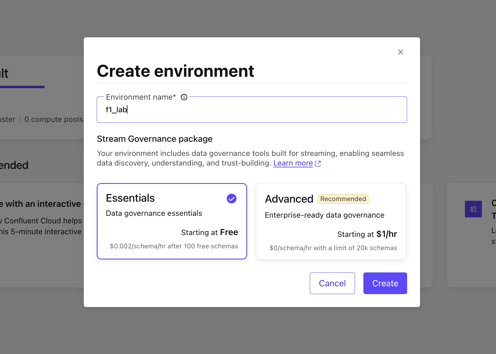

- After creation of new environment screen would be navigated to create a cluster follow below instructions
   - Choose your own name
   - Cluster Type: Basic
   - Provider and Region: `aws`, `us-east-2`
   - Click one Launch Cluster

### Step 2.3: Create Kafka API Key
- Navigate to API Keys as shown in the screenshot below
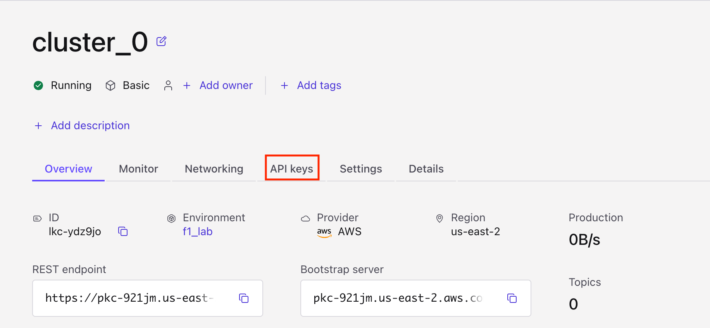
- Click on **Create key**
- Choose **My account** and click **Next**
- Keep Description as empty and click on **Download and Continue** button.

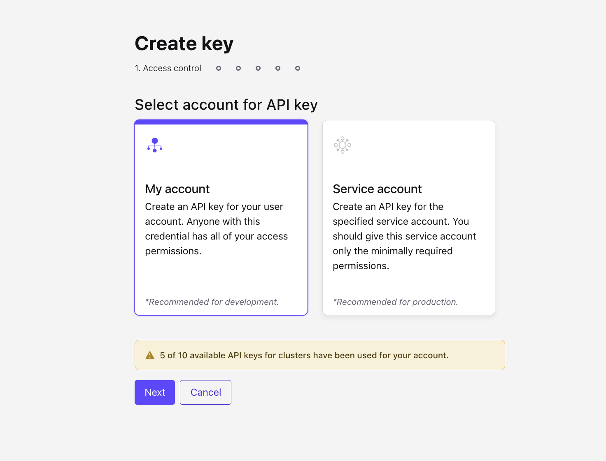

### Step 2.4: Create Schema Registry API Key
- Click on your environment name in the top headbar as shown in the screenshot

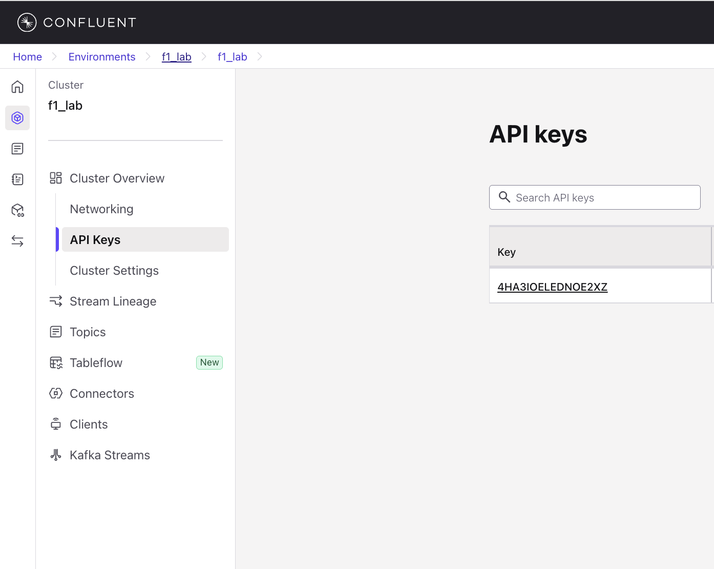

- Navigate to the **Schema Registry** in the left sidebar and click on **API Keys** hyperlink card as shown in the screenshot below

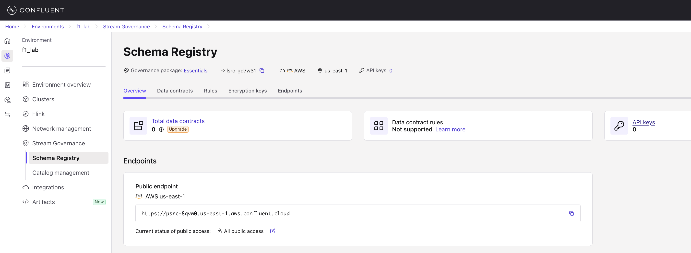

- Click on **Add API Key** button on top right.
- Choose **My Account** and click **Next**.
- Choose your environment and click **Next** as shown in the below screenshot.

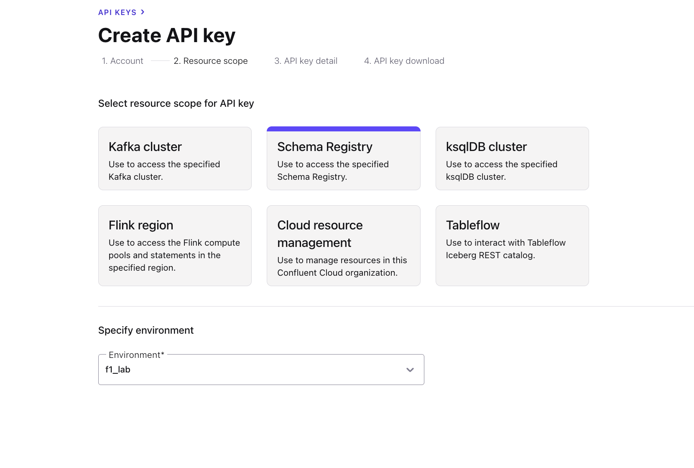

- Give your own **Name** and **Description** and click on **Create API key** as shown below.

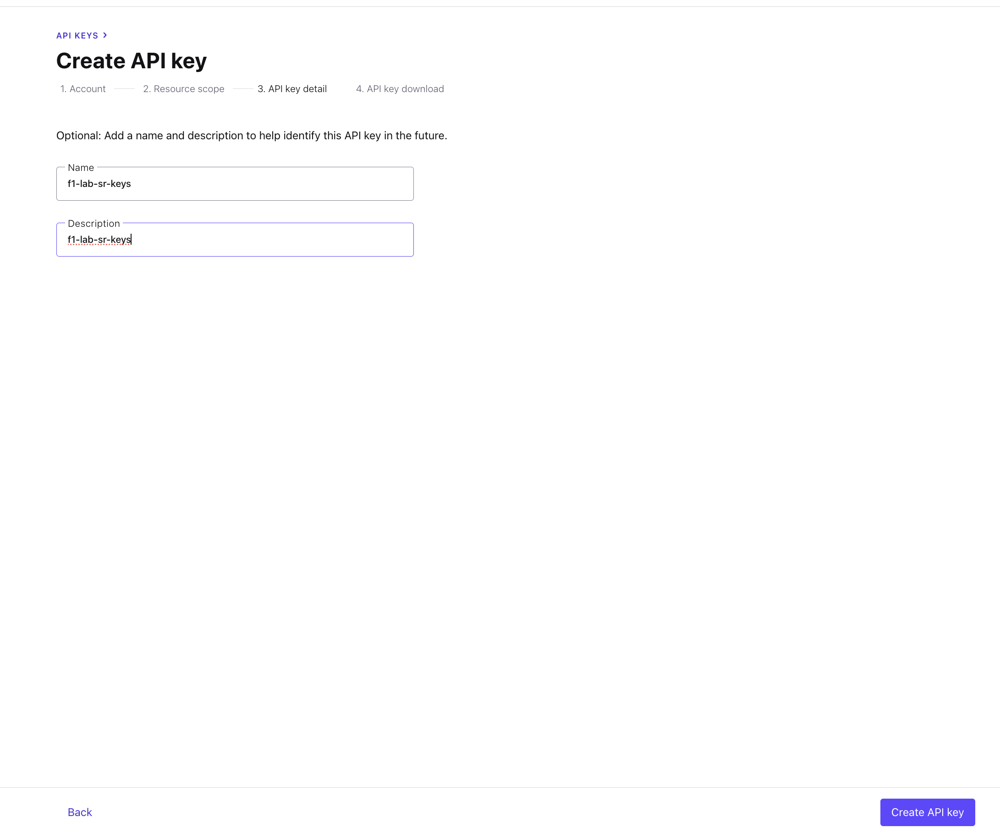

- Click on **Download API key** and **Continue** button.

### Step 2.5: Create Kafka Topics
- Navigate to Environment by clicking [this](https://confluent.cloud/environments) link.
- Choose your environment
- Click Clusters in the left sidebar and choose your cluster.
- Navigate to **Topics** in the left sidebar and click on **Create Topic** as shown in screenshot

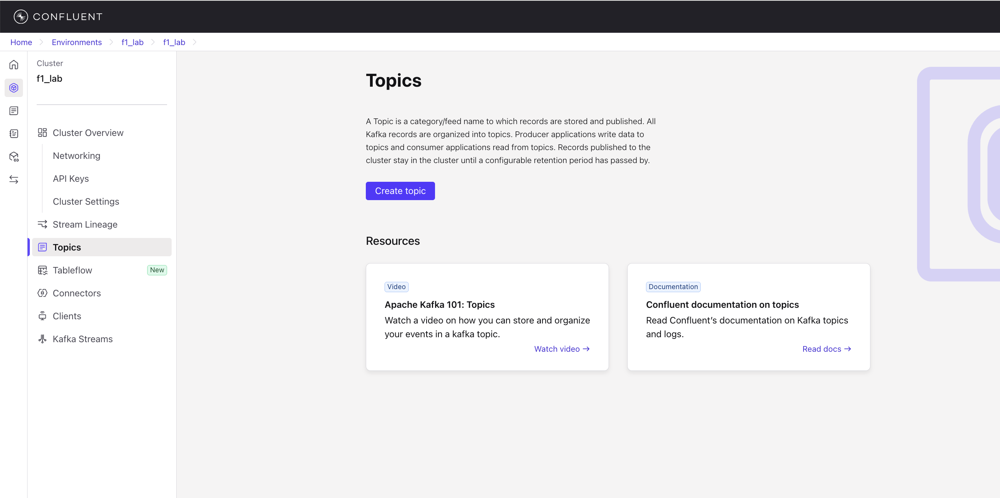

- Use: `f1_driver_positions` for name and click **Create with defaults**

### Step 2.6: Create Flink Compute Pool
- [Navigate to Flink in Confluent Cloud](https://confluent.cloud/go/flink)
- Select your environment.
- Make sure to select the Provider and Region as `aws`, `us-east-2` respectively.
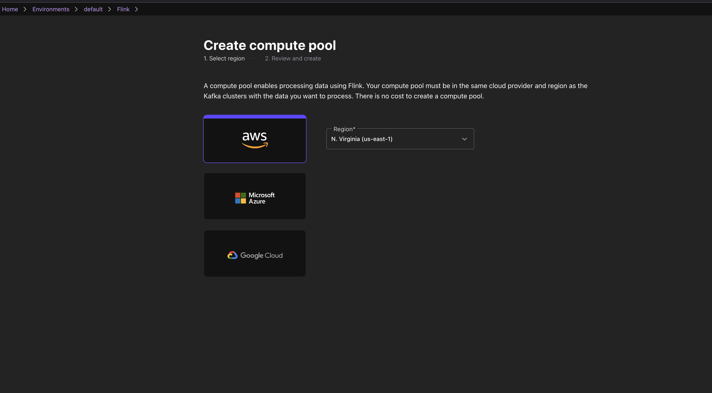
- Click **Continue**, then **Create**
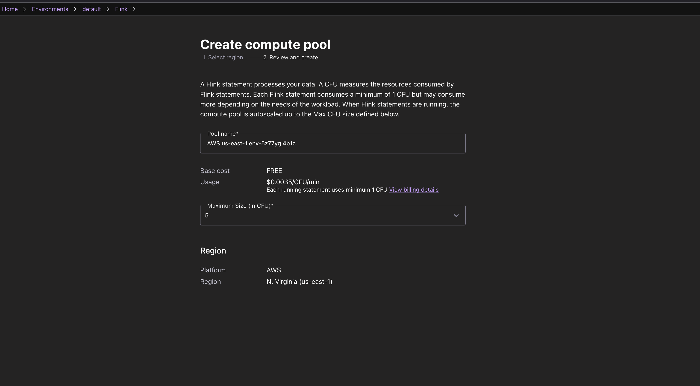

Compute pool should be created within few minutes.


## Part 3: Configure the Application
Update `backend/config.yaml` with your credentials from the downloaded API Keys
```yaml
kafka:
  bootstrap.servers: 'BOOTSTRAP_SERVER_URL_FROM_API_KEY_FILE'
  security.protocol: "SASL_SSL"
  sasl.mechanism: "PLAIN"
  sasl.username: 'YOUR_CONFLUENT_CLOUD_API_KEY'
  sasl.password: 'YOUR_CONFLUENT_CLOUD_API_SECRET'
  schema_registry_url: 'YOUR_SCHEMA_REGISTRY_URL'
  schema_registry_api_key: 'YOUR_SCHEMA_REGISTRY_API_KEY'
  schema_registry_secret: 'YOUR_SCHEMA_REGISTRY_SECRET'
  topics:
    positions: "f1_driver_positions"
    driver_avg_speed: "driver_avg_speed"
  consumer_group: "f1-leaderboard-consumer"
```

## Part 4: Running the Application

### Step 4.1: Start the Backend Server
```bash
cd backend
```
```bash
source venv/bin/activate
```
```bash
python3 main.py
```
> **Note: This command needs to be running all the time. Do not stop this server. Please continue the lab on a new Terminal Tab.**

### Step 3.2: Start the Frontend Application
Open a new terminal. Make sure you are in the directory of the repository (f1-leaderboard-workshop). Then run the following.
```bash
cd frontend
```
```
npm run dev
```

> **Note: This command needs to be running all the time. Do not stop this server. Please continue the lab on a new Terminal Tab.**


### Step 3.3: Access the Application and Start a race
- Open `http://localhost:5173` in your browser
- Select a driver and start a race
This should start generating data to Confluent Cloud.

## [Optional] Understanding Flink

### Flink Compute Pool
Confluent Cloud Flink Compute Pool is a managed environment that provides the resources needed to run Apache Flink jobs directly within Confluent Cloud. It eliminates the need for self-managed Flink clusters by offering a scalable, serverless compute layer for stream processing and real-time analytics on data in Confluent topics.
With Compute Pools, you don't need to manually size your workload. Simply select the maximum number of Confluent Flink Units (CFUs), and Confluent will automatically scale your resources. You are only charged for the CFUs consumed by you.

**Note:** Tables=Kafka topics and database = Kafka Cluster.
For listing all the tables present, run:
```bash
SHOW TABLES;
```
Check that you are able to see f1_driver_positions in the list.

You can add more Workspace cells by clicking the + button on the left.

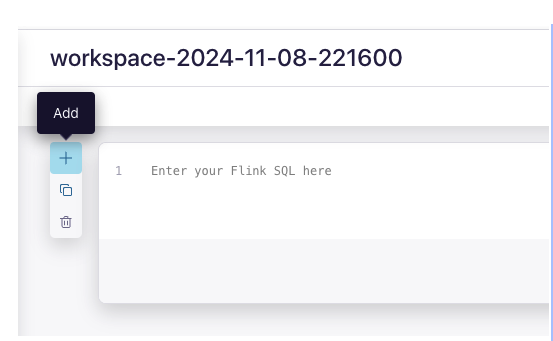

Understand how the table f1_driver_positions was created:
```bash
SHOW CREATE TABLE f1_driver_positions;
```

You can find more information about all parameters [here](https://docs.confluent.io/cloud/current/flink/reference/statements/create-table.html).

### Select Queries
Let us first check the table schema for the f1_driver_positions tables. The logical schema is inferred from the topic's schema in Schema Registry.
```bash
DESCRIBE f1_driver_positions;
```

Let's check if any product records exist in the table.
```bash
SELECT * FROM f1_driver_positions;
```
There are multiple queries available on Confluent Cloud. You can find more information [here](https://docs.confluent.io/cloud/current/flink/reference/queries/overview.html).

## Part 4: Implement Flink SQL Analytics

### Step 4.1: Open SQL Workspace
- In [Flink UI](https://confluent.cloud/go/flink), Open Flink workspace.
- Configure catalog and database
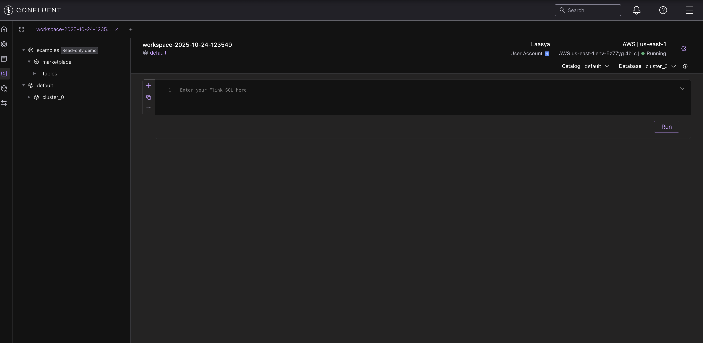
- Set environment and cluster settings
- Verify connection


### Step 4.2: Realtime Analytics with Confluent Cloud for Apache Flink

Create `driver_avg_speed` table:

```sql
CREATE TABLE `driver_avg_speed` (
  driver_name STRING,
  race_id STRING,
  avg_speed DOUBLE,
  PRIMARY KEY (driver_name, race_id) NOT ENFORCED
) WITH (
  'changelog.mode' = 'upsert',
  'value.format' = 'json-registry'
);
```

Calculate average speed in Real-Time:

```sql
INSERT INTO `driver_avg_speed`
SELECT
  driver_name,
  race_id,
  AVG(speed) AS avg_speed
FROM `f1_driver_positions`
GROUP BY driver_name, race_id;
```

## Part 6: Hands-On Lab Exercise

- Select a driver and start a race
- Watch the race starting animation
- Monitor live position updates
- View performance analytics
- Test race management controls


## Results


## Cleanup

### Stop the Application
- Stop backend: `Ctrl+C` in backend terminal
- Stop frontend: `Ctrl+C` in frontend terminal

### Clean Up Confluent Cloud
- Delete cluster: `f1-lab-cluster`
- Delete environment: `f1-lab-environment`

### Local Cleanup
```bash
rm -rf backend/venv
rm -rf frontend/node_modules
```

## Resources
- [Confluent Cloud Documentation](https://docs.confluent.io/cloud/current/)
- [Apache Kafka Documentation](https://kafka.apache.org/documentation/)
- [Apache Flink Documentation](https://flink.apache.org/docs/)
- [FastAPI Documentation](https://fastapi.tiangolo.com/)
- [React Documentation](https://react.dev/)

---

**🎉 Lab Complete!** You've successfully built a real-time F1 analytics application.
