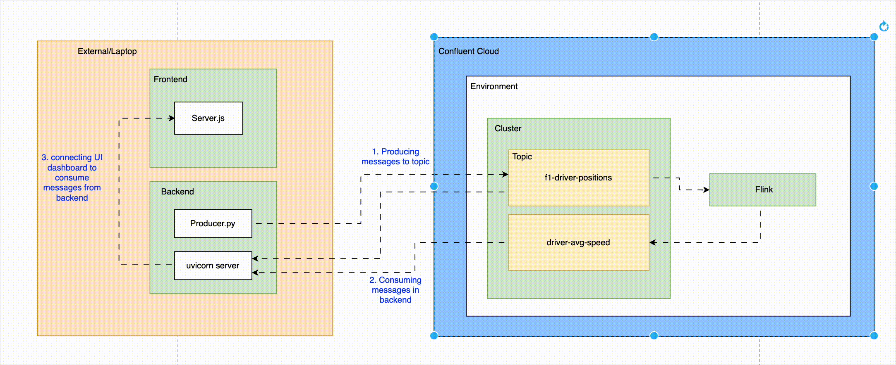
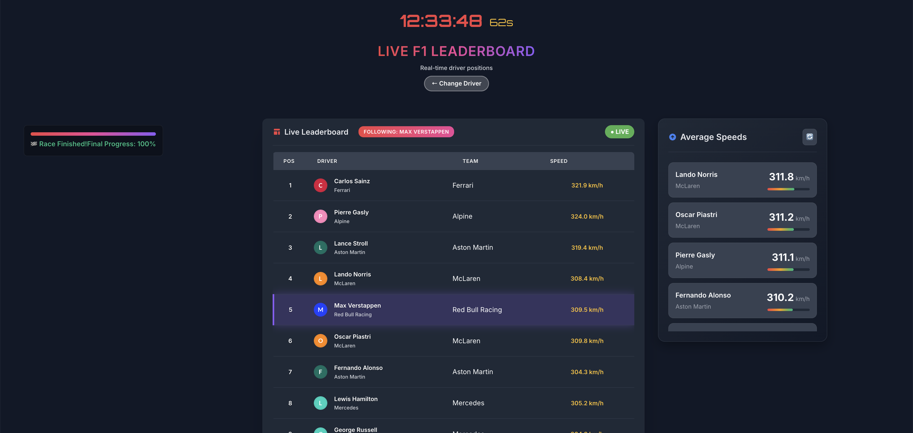

# F1 Real-Time Analytics Lab

## Workshop: Building a Live F1 Leaderboard with Kafka and Flink

This hands-on lab will guide you through building a real-time F1 racing leaderboard application using Apache Kafka, Confluent Cloud, Apache Flink SQL, and React. You'll learn how to implement real-time data streaming, performance analytics, and live dashboards.

### 🎯 Learning Objectives

By the end of this lab, you will:
- Set up a complete real-time data streaming pipeline
- Implement Kafka producers and consumers with schema validation
- Use Apache Flink SQL for real-time analytics
- Build a React frontend with live data updates
- Understand event-driven architecture patterns
- Work with Confluent Cloud and Schema Registry

### 🏁 What You'll Build

A fully functional F1 leaderboard application featuring:
- **Real-time race simulation** with live position updates
- **Performance analytics** with average speed tracking
- **Interactive driver selection** and race management
- **Live dashboard** with Server-Sent Events
- **Data streaming pipeline** using Kafka and Flink SQL



## 📋 Lab Outline

### Lab Steps
1. [Lab Prerequisites](#prerequisites) - Verify environment and accounts
2. [Local Development Environment](#part-1-environment-setup) - Set up Python and Node.js
3. [Confluent Cloud Setup](#part-2-confluent-cloud-setup) - Create Kafka cluster and topics
4. [Running the Application](#part-3-running-the-application) - Start backend and frontend
5. [Implement Flink SQL Analytics](#part-4-implement-flink-sql-analytics) - Set up real-time analytics
6. [Hands-On Lab Exercises](#part-5-hands-on-lab-exercises) - Test and explore the system
7. [Lab Summary & Next Steps](#part-5-lab-summary--next-steps) - Learning outcomes and extensions
8. [Cleanup](#cleanup) - Resource cleanup

## 🏗️ Architecture Overview


## 🛠️ Technology Stack

| Component | Technology | Purpose |
|-----------|------------|----------|
| **Backend** | Python 3.11, FastAPI, Uvicorn | API server and business logic |
| **Data Streaming** | Confluent Cloud, Kafka, Schema Registry | Real-time message streaming |
| **Analytics** | Apache Flink SQL | Real-time data processing |
| **Frontend** | React 19.1.1, Vite, JavaScript | User interface and live updates |
| **Data Validation** | Avro, Pydantic | Schema validation and serialization |
| **Real-time Updates** | Server-Sent Events | Live data streaming to frontend |

## Prerequisites

### Required Software

Before starting this lab, ensure you have the following installed on your machine:

| Software | Version | Download Link | Verification Command |
|----------|---------|---------------|---------------------|
| **Node.js** | 18+ | [Download](https://nodejs.org/) | `node --version` |
| **npm** | 9+ | (comes with Node.js) | `npm --version` |
| **Python** | 3.11+ | [Download](https://www.python.org/downloads/) | `python3 --version` |
| **Git** | Latest | [Download](https://git-scm.com/) | `git --version` |

### Required Accounts

- **Confluent Cloud Account** (Free tier available)
  - Sign up at: [https://www.confluent.io/confluent-cloud/tryfree](https://www.confluent.io/confluent-cloud/tryfree/)

### Pre-Lab Verification

Run these commands to verify your environment:

```bash
# Check Node.js and npm
node --version && npm --version

# Check Python
python3 --version

# Check Git
git --version

# Verify you can create virtual environments
python3 -m venv test_env && rm -rf test_env
```

✅ **All commands should complete without errors before proceeding.**

## Part 1: Environment Setup

### Step 1.1: Clone the Repository

**Objective:** Get the lab code and set up the project structure

1. **Open your terminal/command prompt**
2. **Navigate to your desired directory** (e.g., `~/workshops` or `C:\workshops`)
3. **Clone the repository:**
   ```bash
   git clone https://github.com/kos-conf/f1-leaderboard-workshop.git
   cd f1-flink-version
   ```

**✅ Verification:** You should see the following directory structure:
```
├── backend/
├── frontend/
├── images/
└── README.md
```

### Step 1.2: Set Up Backend Environment

**Objective:** Create a Python virtual environment and install dependencies

1. **Navigate to the backend directory:**
   ```bash
   cd backend
   ```

2. **Create a Python virtual environment:**
   ```bash
   python3 -m venv venv
   ```

3. **Activate the virtual environment:**
   ```bash
   # On macOS/Linux:
   source venv/bin/activate
   
   # On Windows:
   venv\Scripts\activate
   ```

4. **Install Python dependencies:**
   ```bash
   pip install -r requirements.txt
   ```

**✅ Verification:** Run this command to verify the backend setup:
```bash
cd backend
source venv/bin/activate  # or venv\Scripts\activate on Windows
python -c "import fastapi, confluent_kafka; print('Backend dependencies installed successfully!')"
cd ..
```

### Step 1.3: Set Up Frontend Environment

**Objective:** Install Node.js dependencies for the React frontend

1. **Navigate to the frontend directory:**
   ```bash
   cd frontend
   ```

2. **Install Node.js dependencies:**
   ```bash
   npm install
   ```

3. **Return to project root:**
   ```bash
   cd ..
   ```

**✅ Verification:** Run this command to verify the frontend setup:
```bash
cd frontend
npm list react
cd ..
```

You should see React and other dependencies listed without errors.

## Part 2: Confluent Cloud Setup

### Step 2.1: Create Confluent Cloud Account

**Objective:** Set up your Confluent Cloud environment for Kafka streaming

1. **Sign up for Confluent Cloud:**
   - Go to [https://www.confluent.io/confluent-cloud/tryfree](https://www.confluent.io/confluent-cloud/tryfree/)
   - Click "Start free" and create your account
   - No credit card required for the basic cluster

2. **Verify your account:**
   - Check your email and verify your account
   - Log in to the Confluent Cloud console

**✅ Verification:** You should be able to access the Confluent Cloud dashboard at [https://confluent.cloud](https://confluent.cloud)

### Step 2.2: Create Environment and Cluster

**Objective:** Set up the basic infrastructure for your lab

1. **Create an Environment:**
   - In the Confluent Cloud console, click "Create environment"
   - Name it: `f1-lab-environment`
   - Click "Create"

2. **Create a Basic Cluster:**
   - Click "Create cluster"
   - Select "Basic" cluster type
   - Choose your preferred cloud provider and region
   - Name it: `f1-lab-cluster`
   - Click "Create cluster"
   - Wait for the cluster to be ready (2-3 minutes)

**✅ Verification:** You should see your cluster status as "Available" in the Confluent Cloud console

### Step 2.3: Create Kafka API Key

**Objective:** Generate credentials to connect your application to Kafka

1. **Navigate to API Keys:**
   - In the left sidebar, click "API Keys"
   - Click "Add API Key"

2. **Configure the API Key:**
   - Select "User Account" and click "Next"
   - Select your cluster: `f1-lab-cluster`
   - Click "Next"
   - Name: `f1-lab-kafka-key`
   - Description: `API key for F1 lab application`
   - Click "Next"

3. **Download the API Key:**
   - **IMPORTANT:** Click "Download API Key" and save the file
   - The key will not be shown again
   - Click "Complete"

**✅ Verification:** You should have a downloaded file with your API key and secret

### Step 2.4: Create Schema Registry API Key

**Objective:** Set up Schema Registry for data validation

1. **Navigate to Schema Registry:**
   - In the left sidebar, click "Schema Registry"
   - Click "Enable Schema Registry"
   - Choose the same region as your cluster
   - Click "Continue"

2. **Create Schema Registry API Key:**
   - Click "Add API Key"
   - Name: `f1-lab-schema-key`
   - Description: `Schema Registry key for F1 lab`
   - Click "Download API Key" and save the file
   - Click "Complete"

**✅ Verification:** You should have two API key files downloaded

### Step 2.5: Create Kafka Topics

**Objective:** Set up the topics for your data streams

1. **Navigate to Topics:**
   - In the left sidebar, click "Topics"
   - Click "Create topic"

2. **Create Position Topic:**
   - Topic name: `f1-driver-positions`
   - Partitions: 3
   - Click "Create with defaults"

**✅ Verification:** You should see the topic in your topics list

### Step 2.6: Configure Application

**Objective:** Update the application configuration with your Confluent Cloud credentials

1. **Open the configuration file:**
   ```bash
   code backend/config.yaml  # or use your preferred editor
   ```

2. **Update the configuration:**
   Replace the placeholder values with your actual credentials:
   ```yaml
   kafka:
     bootstrap.servers: '<YOUR_CONFLUENT_CLOUD_CLUSTER_URL>'  # From your cluster details
     security.protocol: "SASL_SSL"
     sasl.mechanism: "PLAIN"
     sasl.username: '<YOUR_CONFLUENT_CLOUD_API_KEY>'  # From your Kafka API key file
     sasl.password: '<YOUR_CONFLUENT_CLOUD_API_SECRET>'  # From your Kafka API key file
     schema_registry_url: '<YOUR_SCHEMA_REGISTRY_URL>'  # From Schema Registry details
     schema_registry_api_key: '<YOUR_SCHEMA_REGISTRY_API_KEY>'  # From your Schema Registry API key file
     schema_registry_secret: '<YOUR_SCHEMA_REGISTRY_SECRET>'  # From your Schema Registry API key file
     topics:
       positions: "f1-driver-positions"
       driver_avg_speed: "driver-avg-speed"
     consumer_group: "f1-leaderboard-consumer"
   ```

**✅ Verification:** Your `config.yaml` should contain real values (not placeholders)

## Part 3: Running the Application

### Step 3.1: Start the Backend Server

**Objective:** Launch the FastAPI backend with Kafka integration

1. **Open a new terminal window**
2. **Navigate to the backend directory:**
   ```bash
   cd backend
   ```

3. **Activate the virtual environment:**
   ```bash
   source venv/bin/activate  # On Windows: venv\Scripts\activate
   ```

4. **Start the backend server:**
   ```bash
   python main.py
   ```

**✅ Verification:** You should see:
```
Starting F1 Leaderboard API...
INFO:     Started server process [12345]
INFO:     Uvicorn running on http://0.0.0.0:8001
```

### Step 3.2: Start the Frontend Application

**Objective:** Launch the React frontend for the user interface

1. **Open another new terminal window**
2. **Navigate to the frontend directory:**
   ```bash
   cd frontend
   ```

3. **Start the development server:**
   ```bash
   npm run dev
   ```

**✅ Verification:** You should see:
```
  VITE v5.0.0  ready in 500 ms

  ➜  Local:   http://localhost:5173/
  ➜  Network: use --host to expose
```

### Step 3.3: Access the Application

**Objective:** Open the F1 leaderboard in your browser

1. **Open your web browser**
2. **Navigate to:** `http://localhost:5173`
3. **You should see the F1 Leaderboard application**

**✅ Verification:** The application loads without errors and shows the driver selection screen

## Part 4: Implement Flink SQL Analytics

### Step 4.1: Create Flink Compute Pool

**Objective:** Set up Flink compute resources for real-time analytics processing

1. **Navigate to Flink in Confluent Cloud:**
   - In your Confluent Cloud console, look for "Flink" in the left sidebar
   - If you don't see it, go to "Add-ons" and enable Flink
   - Click on "Flink" to access the Flink management

2. **Create a Flink Compute Pool:**
   - Click "Create compute pool" or "New compute pool"
   - Name it: `f1-analytics-pool`
   - Select the same region as your Kafka cluster
   - Choose "Basic" compute (sufficient for this lab)
   - Set the compute units to 1 (minimum for basic tier)
   - Click "Create compute pool"

3. **Wait for Compute Pool to be Ready:**
   - The compute pool will take 3-5 minutes to provision
   - You'll see a "Ready" status when it's available
   - Note the compute pool ID for later use

**✅ Verification:** You should see your Flink compute pool in "Ready" status

### Step 4.2: Create Flink Workspace

**Objective:** Create a workspace using the compute pool for SQL processing

1. **Create a New Workspace:**
   - In the Flink section, click "Create workspace"
   - Name it: `f1-analytics-workspace`
   - Select your compute pool: `f1-analytics-pool`
   - Choose the same environment as your Kafka cluster
   - Click "Create workspace"

2. **Wait for Workspace to be Ready:**
   - The workspace will take 2-3 minutes to provision
   - You'll see a "Ready" status when it's available

**✅ Verification:** You should see your Flink workspace in "Ready" status

### Step 4.3: Open SQL Workspace

**Objective:** Access the Flink SQL editor and configure the environment

1. **Open SQL Workspace in New Tab:**
   - Click "Open in new tab" or right-click and select "Open in new tab"
   - Keep this tab open throughout the lab

2. **Configure Catalog and Database:**
   - In the SQL workspace, look for the catalog/database selector
   - Select your Confluent Cloud catalog
   - Choose the default database or create a new one if needed

3. **Set Environment and Cluster:**
   - In the workspace settings, ensure the environment is set to your `f1-lab-environment`
   - Verify the cluster is set to your `f1-lab-cluster`
   - Confirm the Schema Registry is properly configured

4. **Verify Connection:**
   - Check that the workspace shows "Connected" status
   - Verify you can see your Kafka topics in the catalog
   - Ensure the SQL editor is ready for queries

**✅ Verification:** SQL workspace is open in a new tab and properly configured with your environment and cluster

### Step 4.4: Create the Driver Average Speed Table

**Objective:** Set up the target table for storing calculated average speeds

1. **Open the SQL Editor:**
   - In your Flink workspace, click "SQL Editor"
   - You'll see a query interface

2. **Create the Average Speed Table:**
   Copy and paste this SQL statement:
   ```sql
   CREATE TABLE driver_avg_speed (
     driver_name STRING,
     race_id STRING,
     avg_speed DOUBLE,
     PRIMARY KEY (driver_name, race_id) NOT ENFORCED
   ) WITH (
     'changelog.mode' = 'upsert',
     'value.format' = 'json-registry'
   );
   ```

3. **Execute the Statement:**
   - Click "Run" or press Ctrl+Enter
   - Wait for the statement to complete successfully
   - You should see a success message

**✅ Verification:** The table is created without errors

### Step 4.5: Implement Real-Time Average Speed Calculation

**Objective:** Create the Flink SQL job to calculate average speeds in real-time

1. **Create the Analytics Query:**
   Copy and paste this SQL statement:
   ```sql
   INSERT INTO driver_avg_speed
   SELECT
     driver_name,
     race_id,
     AVG(speed) AS avg_speed
   FROM f1_driver_positions
   GROUP BY driver_name, race_id;
   ```

2. **Execute the Analytics Job:**
   - Click "Run" to start the analytics job
   - The job will begin processing data in real-time
   - You should see the job status as "Running"

**✅ Verification:** The analytics job is running and processing data

### Step 4.6: Verify Data Flow

**Objective:** Confirm that data is flowing through the Flink SQL pipeline

1. **Check the Output Topic:**
   - Go back to your Confluent Cloud console
   - Navigate to Topics
   - Click on `driver-avg-speed` topic
   - You should see messages being written to this topic

2. **Monitor Message Flow:**
   - In the topic view, click on "Messages"
   - You should see JSON messages with driver names, race IDs, and average speeds
   - Messages should appear in real-time as the race progresses

3. **Verify Data Format:**
   - Click on a message to view its content
   - Verify the JSON structure contains:
     - `driver_name`: Driver's name
     - `race_id`: Race identifier
     - `avg_speed`: Calculated average speed

**✅ Verification:** You can see real-time average speed data in the output topic

### Step 4.7: Test with Live Data

**Objective:** Ensure the Flink SQL job works with your running application

1. **Start a Race in Your Application:**
   - Go to `http://localhost:5173`
   - Select a driver and start a race
   - Let the race run for at least 30 seconds

2. **Monitor Flink Processing:**
   - Check the Flink job metrics
   - Look for processing rates and throughput
   - Verify no errors in the job logs

3. **Check Output Data:**
   - Go back to the `driver-avg-speed` topic
   - Verify new messages are being generated
   - Check that average speeds are being calculated correctly

**✅ Verification:** Flink SQL is processing live race data and generating average speed analytics

## Part 5: Hands-On Lab Exercises

### Exercise 1: Test the Application Flow

**Objective:** Verify the complete application functionality

1. **Select a Driver:**
   - Choose any F1 driver from the selection screen
   - Watch the race starting animation
   - Observe the countdown sequence

2. **Monitor Live Updates:**
   - Watch the leaderboard update in real-time
   - Notice how positions change dynamically
   - Check the progress bar and timer

3. **View Performance Analytics:**
   - Observe the average speed panel
   - Notice how speeds update continuously
   - See your selected driver highlighted

4. **Test Race Management:**
   - Try stopping the race early
   - Start a new race with a different driver
   - Let a race complete naturally

**✅ Success Criteria:** All features work smoothly without errors

## Troubleshooting

### Common Issues and Solutions

#### Backend Won't Start

**Problem:** `python main.py` fails with import errors

**Solutions:**
1. **Check virtual environment:**
   ```bash
   source venv/bin/activate  # or venv\Scripts\activate on Windows
   which python  # Should point to venv/bin/python
   ```

2. **Reinstall dependencies:**
   ```bash
   pip install -r requirements.txt --force-reinstall
   ```

3. **Check Python version:**
   ```bash
   python --version  # Should be 3.11+
   ```

#### Frontend Won't Start

**Problem:** `npm run dev` fails

**Solutions:**
1. **Clear npm cache:**
   ```bash
   npm cache clean --force
   ```

2. **Delete node_modules and reinstall:**
   ```bash
   rm -rf node_modules package-lock.json
   npm install
   ```

3. **Check Node.js version:**
   ```bash
   node --version  # Should be 18+
   ```

#### Kafka Connection Issues

**Problem:** Backend can't connect to Confluent Cloud

**Solutions:**
1. **Verify config.yaml:**
   - Check all credentials are correct
   - Ensure no extra spaces or quotes
   - Verify topic names match exactly

2. **Test connection:**
   ```bash
   # In backend directory with venv activated
   python -c "from confluent_kafka import Producer; print('Kafka connection OK')"
   ```

3. **Check Confluent Cloud:**
   - Verify cluster is running
   - Check API key permissions
   - Ensure topics exist

### Key Learning Outcomes

- **Event-Driven Architecture:** Understanding how real-time data flows through systems
- **Kafka Integration:** Working with producers, consumers, and schema validation
- **Stream Processing:** Using Flink SQL for real-time analytics
- **Modern Web Development:** Building responsive UIs with real-time updates
- **Cloud Services:** Leveraging managed services for scalable infrastructure

### Lab Results


## Cleanup

### Step 1: Stop the Application

1. **Stop the backend:**
   - In the backend terminal, press `Ctrl+C`
   - Wait for graceful shutdown

2. **Stop the frontend:**
   - In the frontend terminal, press `Ctrl+C`
   - Close the terminal windows

### Step 2: Clean Up Confluent Cloud

1. **Delete Topics:**
   - Go to Confluent Cloud console
   - Navigate to Topics
   - Delete `f1-driver-positions`
   - Delete `driver-avg-speed`

2. **Delete Cluster:**
   - Go to your cluster settings
   - Click "Delete cluster"
   - Confirm deletion

3. **Delete Environment:**
   - If you don't need the environment anymore
   - Delete the entire environment

### Step 3: Local Cleanup

1. **Remove Virtual Environment:**
   ```bash
   rm -rf backend/venv
   ```

2. **Clean Node Modules (Optional):**
   ```bash
   rm -rf frontend/node_modules
   ```

## Resources & Further Learning

### Documentation
- [Confluent Cloud Documentation](https://docs.confluent.io/cloud/current/)
- [Apache Kafka Documentation](https://kafka.apache.org/documentation/)
- [Apache Flink Documentation](https://flink.apache.org/docs/)
- [FastAPI Documentation](https://fastapi.tiangolo.com/)
- [React Documentation](https://react.dev/)

### Community
- [Confluent Community](https://www.confluent.io/community/)
- [Apache Kafka Community](https://kafka.apache.org/community)
- [Flink Community](https://flink.apache.org/community.html)

### Additional Labs
- [Confluent Developer](https://developer.confluent.io/)
- [Kafka Streams Tutorials](https://kafka.apache.org/documentation/streams/)
- [Flink Training](https://flink.apache.org/training/)

---

**🎉 Lab Complete!** You've successfully built a real-time F1 analytics application. Keep exploring and building amazing data streaming applications!
