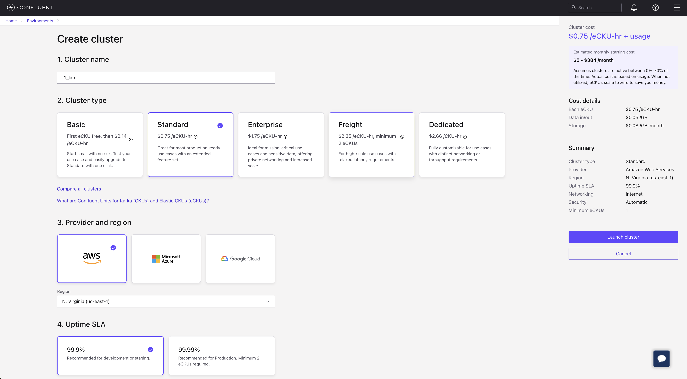
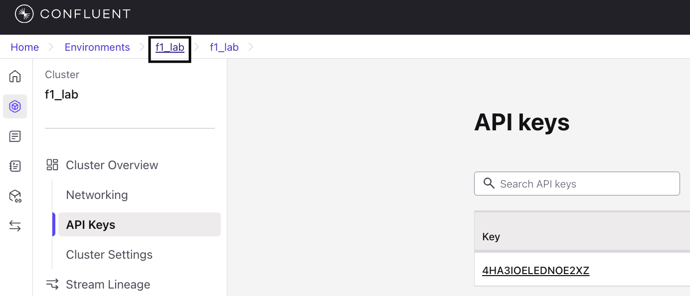
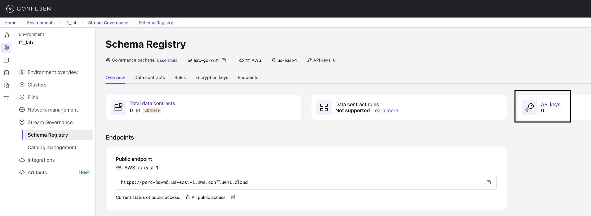

# F1 Real-Time Analytics Lab

## Building a Live F1 Leaderboard with Kafka and Flink

Build a real-time F1 racing leaderboard using Apache Kafka, Confluent Cloud, Apache Flink SQL, and React.

### What You'll Build
- Real-time race simulation with live position updates
- Performance analytics with average speed tracking
- Interactive driver selection and race management
- Live dashboard with Server-Sent Events


## Prerequisites

### Required Software
| Software | Version | Verification Command |
|----------|---------|---------------------|
| **Node.js** | 18+ | `node --version` |
| **npm** | 9+ | `npm --version` |
| **Python** | 3.11+ | `python3 --version` |
| **pip** | Latest | `pip3 --version` |
| **Git** | Latest | `git --version` |

### Required Accounts
- **Confluent Cloud Account** (Free tier available)
  - Sign up at: [https://www.confluent.io/confluent-cloud/tryfree](https://www.confluent.io/confluent-cloud/tryfree/)

### Pre-Lab Verification
```bash
node --version && npm --version
```
```bash
python3 --version && pip3 --version
```
```bash
git --version
```
```bash
python3 -m venv test_env && rm -rf test_env
```

## Part 1: Environment Setup

### Step 1.1: Clone the Repository
```bash
git clone https://github.com/kos-conf/f1-leaderboard-workshop.git && cd f1-leaderboard-workshop
```

### Step 1.2: Set Up Backend Environment
```bash
cd backend
```
```bash
python3 -m venv venv
```
On MacOS
```bash
source venv/bin/activate  
```
On Windows: 
```bash
venv\Scripts\activate
```
```bash
pip install -r requirements.txt
```
```bash
cd ..
```

### Step 1.3: Set Up Frontend Environment
```bash
cd frontend
```
```bash
npm install
```
```bash
cd ..
```

## Part 2: Confluent Cloud Setup

### Step 2.1: Create Confluent Cloud Account
- Go to [https://www.confluent.io/confluent-cloud/tryfree](https://www.confluent.io/confluent-cloud/tryfree/)
- Sign up and verify your account

### Step 2.2: Create Environment and Cluster
- Create environment by clicking [this](https://confluent.cloud/create-environment) link and using the name like below


- After creation of new environment screen would be navigated to create a cluster follow below instructions
   - Choose your own name
   - Cluster Type: Standard
   - Provider and Region: aws, `us-east-1`
   - Uptime SLA: 99.9%
   - Click one Launch Cluster



- Wait for cluster to be ready

### Step 2.3: Create Kafka API Key
- Navigate to API Keys in the left sidebar
- Click on **Create key**
- Choose **My account** and click **Next**
- Keep Description as empty and click on **Download and Continue** button.


### Step 2.4: Create Schema Registry API Key
- Click on your environment name in the top headbar as shown in the screenshot



- Navigate to the **Schema Registry** in the left sidebar and click on **API Keys** hyperlink card as shown in the screenshot below



- Click on **Add API Key** button on top right.
- Choose **My Account** and click **Next**.
- Choose your environment and click **Next** as shown in the below screenshot.


- Give your own **Name** and **Description** and click on **Create API key** as shown below.


- Click on **Download API key** and **Continue** button.

### Step 2.5: Create Kafka Topics
- Navigate to Environment by clicking [this](https://confluent.cloud/environments) link.
- Choose your environment
- Click Clusters in the left sidebar and choose your cluster.
- Navigate to **Topics** in the left sidebar and click on **Create Topic** as shown in screenshot


- Use: `f1-driver-positions` for name and `3` for partitions

### Step 2.6: Configure Application
Update `backend/config.yaml` with your credentials from the downloaded API Keys
```yaml
kafka:
  bootstrap.servers: 'BOOTSTRAP_SERVER_URL_FROM_API_KEY_FILE'
  security.protocol: "SASL_SSL"
  sasl.mechanism: "PLAIN"
  sasl.username: 'YOUR_CONFLUENT_CLOUD_API_KEY'
  sasl.password: 'YOUR_CONFLUENT_CLOUD_API_SECRET'
  schema_registry_url: 'YOUR_SCHEMA_REGISTRY_URL'
  schema_registry_api_key: 'YOUR_SCHEMA_REGISTRY_API_KEY'
  schema_registry_secret: 'YOUR_SCHEMA_REGISTRY_SECRET'
  topics:
    positions: "f1-driver-positions"
    driver_avg_speed: "driver-avg-speed"
  consumer_group: "f1-leaderboard-consumer"
```

## Part 3: Running the Application

### Step 3.1: Start the Backend Server
```bash
cd backend
```
```bash
source venv/bin/activate
```
```bash
python3 main.py
```
## Note: Do not stop this server

### Step 3.2: Start the Frontend Application
```bash
cd frontend
```
npm run dev
```

### Step 3.3: Access the Application
- Open `http://localhost:5173` in your browser

## Part 4: Implement Flink SQL Analytics

### Step 4.1: Create Flink Compute Pool
- Navigate to Flink in Confluent Cloud
- Create compute pool: `f1-analytics-pool`
- Set Maximum Size to 5 CFU
- Wait for pool to be ready

### Step 4.2: Open SQL Workspace
- Open Flink workspace in new tab
- Configure catalog and database
- Set environment and cluster settings
- Verify connection

### Step 4.3: Create the Driver Average Speed Table
```sql
CREATE TABLE `driver-avg-speed` (
  driver_name STRING,
  race_id STRING,
  avg_speed DOUBLE,
  PRIMARY KEY (driver_name, race_id) NOT ENFORCED
) WITH (
  'changelog.mode' = 'upsert',
  'value.format' = 'json-registry'
);
```

### Step 4.4: Set Up the Data Source
```sql
CREATE TABLE f1_driver_positions (
  driver_name STRING,
  position INT,
  speed DOUBLE,
  race_id STRING,
  timestamp BIGINT
) WITH (
  'connector' = 'kafka',
  'topic' = 'f1-driver-positions',
  'properties.bootstrap.servers' = '<YOUR_CONFLUENT_CLOUD_CLUSTER_URL>',
  'properties.security.protocol' = 'SASL_SSL',
  'properties.sasl.mechanism' = 'PLAIN',
  'properties.sasl.jaas.config' = 'org.apache.kafka.common.security.plain.PlainLoginModule required username="<YOUR_CONFLUENT_CLOUD_API_KEY>" password="<YOUR_CONFLUENT_CLOUD_API_SECRET>";',
  'format' = 'json-registry',
  'scan.startup.mode' = 'latest-offset'
);
```

### Step 4.5: Test with Live Data
- Start a race in your application
- Let it run for 30 seconds
- Check the `driver-avg-speed` topic for data

### Step 4.6: Implement Real-Time Average Speed Calculation
```sql
INSERT INTO `driver-avg-speed`
SELECT
  driver_name,
  race_id,
  AVG(speed) AS avg_speed
FROM `f1-driver-positions`
GROUP BY driver_name, race_id;
```

## Part 5: Hands-On Lab Exercises

### Exercise 1: Test the Application Flow
- Select a driver and start a race
- Watch the race starting animation
- Monitor live position updates
- View performance analytics
- Test race management controls

### Exercise 2: Explore the Data Flow
- Check Kafka topics in Confluent Cloud
- Monitor Schema Registry
- Test API endpoints
- Verify Flink analytics

## Results


## Cleanup

### Stop the Application
- Stop backend: `Ctrl+C` in backend terminal
- Stop frontend: `Ctrl+C` in frontend terminal

### Clean Up Confluent Cloud
- Delete topics: `f1-driver-positions` and `driver-avg-speed`
- Delete cluster: `f1-lab-cluster`
- Delete environment: `f1-lab-environment`

### Local Cleanup
```bash
rm -rf backend/venv
rm -rf frontend/node_modules
```

## Resources
- [Confluent Cloud Documentation](https://docs.confluent.io/cloud/current/)
- [Apache Kafka Documentation](https://kafka.apache.org/documentation/)
- [Apache Flink Documentation](https://flink.apache.org/docs/)
- [FastAPI Documentation](https://fastapi.tiangolo.com/)
- [React Documentation](https://react.dev/)

---

**🎉 Lab Complete!** You've successfully built a real-time F1 analytics application.